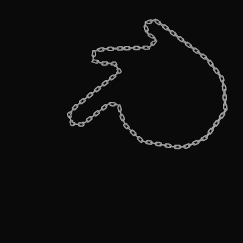
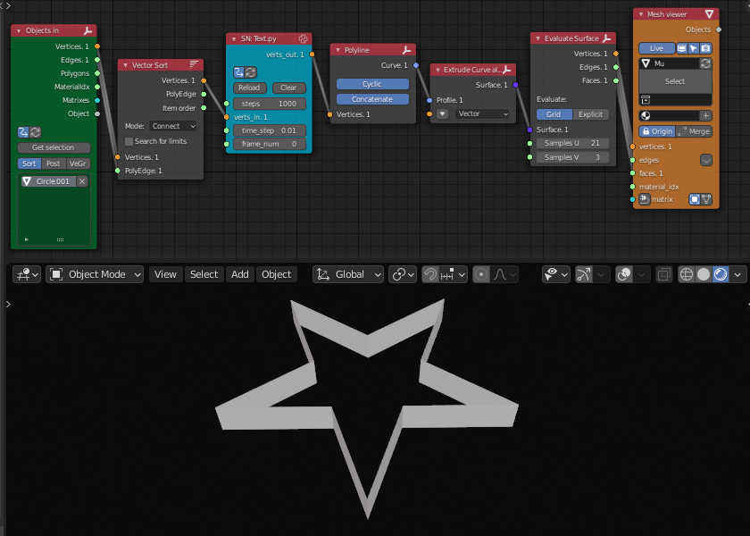

## Overview

This script simulates Curvature Flow in Blender with Script Node Lite (SNLite) node of Sverchok add-on, based on the paper written by Keenan Crane et. al.

Currently, this repository has only a script for Willmore Flow 1D.

## Description

This implementation is based on K. Crane's original paper and other related references.

This code is intended to be used with SNLite node in Sverchok add-on for Blender. Sverchok add-on is a node base add-on, and this script can be loaded using SNLite node in the add-on. Once this script is loaded in the node, you can make various types of applications using the simulation with other nodes.

## Usage

### Preparation

To load this script:
- Install Blender.  
- Install Sverchok add-on.  
- Open Sverchok node Editor.  
- Click '+New' button to open new node editor data block.  
- Add 'ScriptNodeLite' node in the block.
- Open Text Editor in another Area.  
- Click '+New' button to open new text data block.  
- Copy and paste the script in the text block.  
- Put the text block name to the text box in 'ScriptNodeLite' node and click the right button in the node.  
- Connect input datas from other nodes and use output data with other ones.  

### Parameters

- steps: Total steps to generate animation frames
- verts_in: Vertices list of source object(s)
- time_step: 'dt' (Delta time) value to multiply curvature difference
- frame_num: Frame number for the output

## Examples

These are some example of this flow simulation. You have to prepare source object. SVG files can be imported into Blender and you can use them as the source objects of this script.

### Chain movement

Images below is the node tree of this simulation, vertex indices of the source object and array element along the output curve (, array element has 2 modifiers, array modifier and curve modifier)).

### Mesh boundary

Images below is the tree node of this simulation and vertex indices of the source object.

### Cookie-cutter reshaping

Images blow is the node tree of this simulation and source object.

### Limitation

Some shapes which have complex shapes and sharp curves may not work well with this script (, usually the last edge becomes longer).

When this occur, try to do some of the list below. Some of them might change your curvature flow.  
- Rotate the vertices list to change the first vertex position.  
- Reverse the order of the vertices list.  
- Subdivide or un-subdivide the edges to change edge lengths.  
- Change the parameter 'dt' to speed up or slow down the flow step.

## References

- [https://www.cs.cmu.edu/~kmcrane/Projects/ConformalWillmoreFlow/:title]  
- [https://kirilllykov.github.io/blog/2014/01/17/curvature-flow-in-curvature-space/:title]  
- [https://blumenta.github.io/2019/02/09/curvature-flow/:title]  
- [https://masahirodll.com/discretedifferentialgeometry/tutorial-1d-curvature-flow/:title]   (Japanese Language)
- [https://ryamada.hatenadiary.jp/entry/20150408/1428199073:title] (Japanese Language)

## Author

asahidari

## LICENSE

[GPL 3](https://www.gnu.org/licenses/quick-guide-gplv3.html)
